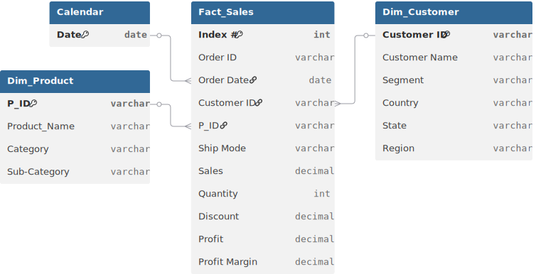

# 📊 Project Background: GlobalMart Bangladesh Sales Analysis Report

**GlobalMart Bangladesh** is a premier multi-category retailer supplying **Furniture, Technology, and Office Supplies** to a diverse customer base across the country. Operating in key regions like **Central, Northern, Eastern, and Southern**, the company faced a significant **"Profit-Discount Paradox."** While annual sales volumes were hitting record highs, net profit margins were being eroded by aggressive discounting and inconsistent regional shipping costs.

**The mission was to stop "Profit Bleed."** Management was focused purely on top-line sales growth without visibility into which product categories or regions were actually destroying value. As a Business Analyst, I audited four years of transaction data to identify high-cost shipping modes and pinpoint where excessive discounts were neutralizing revenue. I provided a data-backed roadmap to optimize the discount structure and refocus efforts on high-margin technology segments.

Insights and recommendations are provided on the following key areas:

* **Regional Profitability** (The Central Hub vs. Rural Saturation)
* **Product Category Intelligence** (Technology vs. Furniture Margins)
* **Shipping & Logistics Efficiency** (Cost-to-Delivery Analysis)
* **Customer Segmentation** (Consumer vs. Corporate Value)

https://github.com/user-attachments/assets/0add17c6-778a-42a5-9e77-59f50e3e7bfb

[The analytical calculations were performed using Microsoft Excel's Pivot Table features.]

**Power Query M Code regarding data preparation process of the sales table can be found [[here]](https://github.com/mehedibhai101/Retail_Sales_Analysis/blob/main/data_cleaning.m).**

---

# 🏗️ Data Structure & Investigative Scope

The analysis was performed on a granular **retail transaction dataset**, linking order logistics to financial performance across Bangladesh.

* **`Transaction Metrics`:** `Sales`, `Quantity`, `Discount`, `Profit`, and `Profit Margin`.
* **`Product Intelligence`:** Categorization into **Furniture, Technology, and Office Supplies**, further refined by `Sub-Category` (e.g., Phones, Bookcases).
* **`Geographic Tiers`:** Performance mapping across **Regions** (Central, Northern, Eastern, Southern) and individual **States** (e.g., Dhaka, Gaibandha).
* **`Logistics & Segments`:** Analysis of `Ship Mode` (Standard, Second Class, Same Day) and `Customer Segment` (Consumer, Corporate, Home Office).

### 🗺️ Entity Relationship Diagram (ERD)


---

# 📋 Executive Summary

GlobalMart Bangladesh is heavily dependent on the **Central Region (Dhaka)** for volume, but the real profit drivers are hidden in the **Technology** category (specifically Accessories and Phones). The analysis revealed a massive performance skew: **Furniture** generates high revenue but suffers from low margins due to heavy discounting and high shipping weight. Crucially, the data exposed that the **Corporate segment** provides more stable, high-margin orders compared to the price-sensitive **Consumer segment**, particularly when using "Standard Class" shipping.


---

# 🔍 Strategic Insights

### 🌍 Regional & Store Operations

* **The Central Powerhouse:** The **Central region (Dhaka)** emerged as the dominant revenue engine. High urbanization and corporate density make it the most efficient region for high-ticket Technology sales.
* **The Northern Margin Gap:** While sales in the **Northern region** are steady, profit margins are consistently lower. This is largely due to high shipping distances and a higher reliance on "Second Class" shipping for bulky furniture.
* **State-Level Variance:** States like **Dhaka and Noakhali** show the highest "Profit per Order," whereas more remote areas are seeing their margins thinned by logistics and discount-heavy promotions.

### 📦 Product & Category Analysis

* **The "Profit Multiplier":** **Technology** (Accessories and Phones) remains the most lucrative category. These items have high value-to-weight ratios, making them the most profitable to ship across all regions.
* **The "Anchor" Liability:** **Furniture** (specifically Chairs and Bookcases) acts as a revenue anchor, but high discount rates (often 20%+) frequently push these transactions into "negative profit" territory.
* **Office Supplies Stability:** Categories like **Labels and Paper** provide consistent, low-risk volume with stable margins, acting as the operational backbone for the Corporate segment.

### 📈 Segment & Shipping Trends

* **The Corporate Edge:** Sales data indicates that the **Corporate segment** has a higher Average Order Value (AOV) and a lower sensitivity to discounts compared to individual Consumers.
* **Shipping Cost Impact:** **Standard Class** shipping is the most cost-effective mode for maintaining margins, whereas **Same Day** shipping is often utilized for low-margin items, creating a net loss on those orders.

---

# 🚀 Strategic Recommendations

* **Discount Optimization:** Implement a **"Discount Ceiling"** of 10% on all Furniture items. The data shows that discounts beyond this point do not significantly increase quantity sold but do significantly destroy profit.
* **Corporate Hub Expansion:** Double down on **Corporate-targeted marketing** in the Central and Eastern regions. The data supports a 15% projected margin increase by shifting focus away from discount-seeking retail consumers.
* **Logistics Re-Routing:** Incentivize "Standard Class" shipping for bulky items. Re-evaluate the pricing for "Same Day" shipping to ensure it covers the operational cost of fast-tracking low-margin Office Supplies.
* **Tech-First Inventory:** Increase inventory depth in **Technology (Accessories and Phones)**. These are the current profit leaders, and the data suggests they should be the primary focus of all seasonal promotional campaigns.

---

## ⚠️ Assumptions and Caveats (Data Issues)

* **Date Formatting:** Order dates were provided in a mixed format (M/D/YYYY) and required standardization to allow for accurate yearly growth tracking.
* **Regional Mapping:** Region tags (Northern, Eastern, etc.) were mapped based on state-level data; any inconsistencies in state naming were cleaned to ensure regional accuracy.
* **Profit Margin Calculation:** Profit Margin is calculated as `Profit / Sales`. It is assumed that the `Profit` field already accounts for the `Discount` applied at the point of sale.

---

## 📂 Repository Structure

```
Supplier_Sales_Analysis_Report/
│
├── Data Cleaning/                        # Power Query M Codes for cleaning tables of the dataset.
│
├── Dataset/                              # The data foundation of the project
│   ├── entity_relationship_diagram.svg   # Visual map of table connections and cardinality
│   └── sales_data.csv
│
├── LICENSE                               # Legal terms for code and data usage
└── README.md                             # Project background, summary and key insights
``` 

---

## 🛡️ License

This project is licensed under the [MIT License](LICENSE). You are free to use, modify, and distribute it with proper attribution.

---

## 🌟 About Me

Hi! I’m **Mehedi Hasan**, well known as **Mehedi Bhai**, a Certified Data Analyst with strong proficiency in *Excel*, *Power BI*, and *SQL*. I specialize in data visualization, transforming raw data into clear, meaningful insights that help businesses make impactful data-driven decisions.

Let’s connect:

[](https://www.linkedin.com/in/mehedi-hasan-b3370130a/)
[](https://youtube.com/@mehedibro101?si=huk7eZ05dOwHTs1-)
